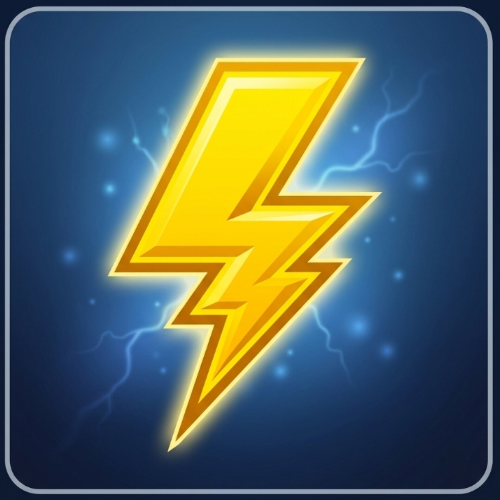

# ⚡ ECE-SPARK

### The Next-Generation Academic & Career Platform for Electronics and Communication Engineers

Transforming ECE education through structured learning, intelligent progress tracking, AI-powered assistance, and industry-ready skill development.

**Published by Creovisia**  
**Developed by Mukil Karki M**

Version: 1.0.0 Beta

---

## 🚀 Overview

ECE-SPARK is a modern student productivity and career development platform built specifically for Electronics and Communication Engineering students.

The platform combines academic management, skill development, project tracking, placement preparation, and emerging technology roadmaps into a single ecosystem.

From first-year fundamentals to industry-ready expertise, ECE-SPARK helps students track, learn, build, and grow throughout their engineering journey.

---

## 🎯 Mission

To empower ECE students with a centralized platform that bridges the gap between academic learning and real-world industry requirements.

---

## 🌟 Core Features

### 📚 Academic Management

- Semester-wise Learning Roadmaps
- Subject Tracking
- Notes Management
- Resource Library
- Lab Record Organization
- Internal Assessment Tracking
- Attendance Monitoring
- Academic Progress Dashboard

### 📈 Performance Tracking

- XP-Based Growth System
- Achievement Badges
- Daily Streaks
- Skill Progress Analytics
- Learning Milestones
- Personalized Insights

### 🧮 Student Utilities

- CGPA Calculator
- GPA Calculator
- Attendance Calculator
- Study Planner
- Task Management
- Goal Tracking

### 💼 Career Development

- Placement Preparation Hub
- Aptitude Training
- Interview Preparation
- Resume Development
- Career Roadmaps
- Internship Guidance

---

## 🛡️ Optional Specialization Tracks

Students can unlock and follow specialized learning paths:

### 🤖 AI Engineering

- Python Foundations
- Machine Learning
- Deep Learning
- LLM Applications
- AI Project Development
- Industry Roadmaps

### 🔐 Cybersecurity

- Networking Fundamentals
- Ethical Hacking Concepts
- Security Operations
- Digital Forensics
- Security Certifications
- Industry Preparation

---

## 🔥 Future Roadmap

### Phase 1

- Academic Dashboard
- Authentication System
- Progress Tracking
- Resource Management

### Phase 2

- AI Learning Assistant
- Smart Recommendations
- Community Features
- Gamification Expansion

### Phase 3

- Placement Analytics
- AI-Powered Career Guidance
- Project Marketplace
- Industry Mentorship

### Phase 4

- Multi-Department Expansion
- Enterprise Education Tools
- Campus Integration
- Global Student Network

---

## 🏗️ Technology Stack

### Frontend

- HTML5
- CSS3
- JavaScript (ES6+)

### Backend Services

- Firebase Authentication
- Firebase Firestore
- Firebase Storage

### Cloud Services

- Cloudinary
- OpenRouter AI APIs

### Deployment

- GitHub Pages
- Cloudflare Services

---

## 📱 Design Philosophy

ECE-SPARK follows a mobile-first approach ensuring:

- Fast Performance
- Responsive Design
- Modern UI/UX
- Accessibility
- Scalability

---

## 🔒 Security

Security and user privacy are prioritized through:

- Secure Authentication
- Protected User Data
- Cloud-Based Infrastructure
- Access Control Mechanisms

---

## 📊 Project Status

**Current Status:** Active Development

**Release Channel:** Public Beta

**Version:** 1.0.0

**Maintained By:** Mukil Karki M

---

## 🏢 Publisher

### Creovisia

Creovisia focuses on building innovative technology solutions, educational platforms, digital products, and next-generation learning ecosystems.

---

## 👨‍💻 Developer

### Mukil Karki M

Founder, Developer, and Product Architect of ECE-SPARK.

Focused on building impactful educational technology platforms that empower students and future innovators.

---

## 📜 License

Copyright © 2026 Creovisia.

Developed by Mukil Karki M.

All Rights Reserved.

Unauthorized reproduction, modification, distribution, or commercial use of this software is prohibited without written permission.

---

## 🌍 Vision

To become the leading digital ecosystem for Electronics and Communication Engineering students by integrating education, innovation, productivity, artificial intelligence, and career growth into a unified platform.

---

### ⚡ Learn • Build • Innovate • Grow

**ECE-SPARK — Igniting the Future of ECE Learning**

Published by Creovisia

